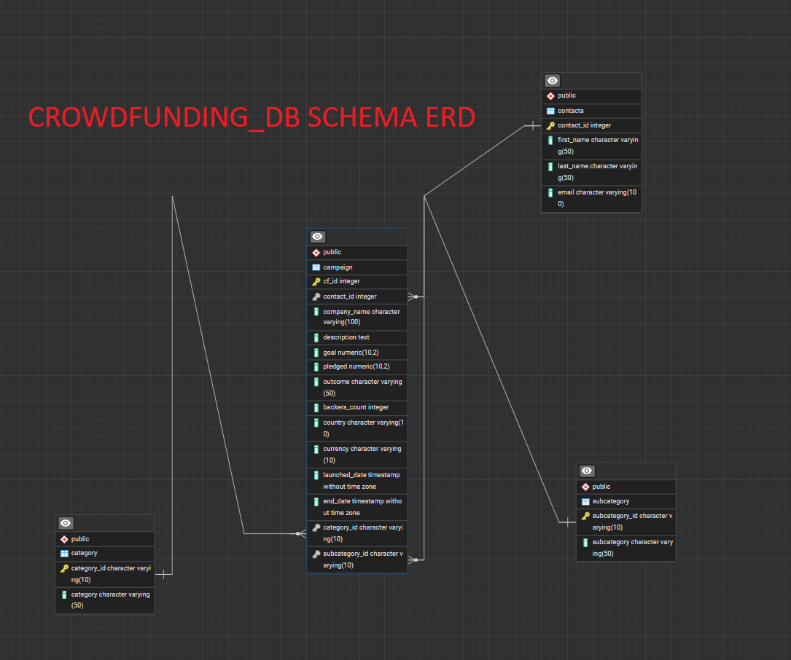

    

<h1 style="color: blue; font-size: 2em;">ETL Mini Project</h1>

## Description
This project involves extracting, transforming, and loading (ETL) crowdfunding data. The main tasks include creating category and subcategory DataFrames, 
processing campaign data, and preparing a contacts DataFrame. The final step involves creating a "crowdfunding_db" PostgreSQL database schema and importing 
the analyzed and cleaned-up data. Final test is to run queries on each table.

## Technologies Used
- Python
- Pandas
- PostgreSQL

## Libraries Used
- pandas
- numpy
- json

## Data Processing

### Original Data Provided in Resources Folder
- crowdfunding.xlsx
- contacts.xlsx

## Data-source Analysis 
-provided in "ETL_Mini_Project_SSergeev.ipynb" Jupyter Notebook

### Category and Subcategory DataFrames
Two separate DataFrames were created for categories and subcategories:
- `category_df`: Contains unique categories with corresponding category IDs
- `subcategory_df`: Contains unique subcategories with corresponding subcategory IDs

### Campaign DataFrame
The `campaign_df` was created by transforming the crowdfunding data:
- Renamed columns for clarity
- Converted data types (e.g., goal and pledged amounts to float)
- Formatted dates using datetime
- Created category and subcategory columns using the IDs from previous DataFrames

### Contacts DataFrame
The `contacts_df_clean` was created by:
- Extracting contact information from JSON data
- Splitting the name column into first_name and last_name
- Reordering columns and changing data types as needed

## Database Schema --- ERD (provided snapshot below)
A database schema (`crowdfunding_db_schema.sql`) was created to define the structure of the crowdfunding database. The schema includes tables for:
- Categories
- Subcategories
- Campaigns
- Contacts

    

## Data Import
The processed DataFrames were exported as CSV files and imported into the corresponding tables in the PostgreSQL "crowdfunding_db" database.

## Testing the Database

After importing the data into the PostgreSQL database, it's crucial to verify the integrity and correctness of the imported data. 
Here's how you can test the database and run SELECT statements on all the tables:

### 1. Connect to the Database
First, ensure you're connected to the "crowdfunding_db" database in PostgreSQL.

### 2. Run SELECT Statements

Run the following SELECT statements to verify the data in each table:

SELECT * FROM campaign;

SELECT * FROM category;

SELECT * FROM contacts;

SELECT * FROM subcategory;

## Usage
1. Run the Jupyter Notebook to process the data and create CSV files
2. Use the provided SQL schema to create the database structure
3. Import the CSV files into the corresponding database tables
4. Verify the data import by running SELECT queries on each table

## Contributors
- Sergeev, Sergei. Phimister, Dylan. Rhee, Michael.

## License
MIT License

Copyright (c) 2024 Sergei Sergeev, Dylan Phimister, Michael Rhee

Permission is hereby granted, free of charge, to any person obtaining a copy
of this software and associated documentation files (the "Software"), to deal
in the Software without restriction, including without limitation the rights
to use, copy, modify, merge, publish, distribute, sublicense, and/or sell
copies of the Software, and to permit persons to whom the Software is
furnished to do so, subject to the following conditions:

The above copyright notice and this permission notice shall be included in all
copies or substantial portions of the Software.

THE SOFTWARE IS PROVIDED "AS IS", WITHOUT WARRANTY OF ANY KIND, EXPRESS OR
IMPLIED, INCLUDING BUT NOT LIMITED TO THE WARRANTIES OF MERCHANTABILITY,
FITNESS FOR A PARTICULAR PURPOSE AND NONINFRINGEMENT. IN NO EVENT SHALL THE
AUTHORS OR COPYRIGHT HOLDERS BE LIABLE FOR ANY CLAIM, DAMAGES OR OTHER
LIABILITY, WHETHER IN AN ACTION OF CONTRACT, TORT OR OTHERWISE, ARISING FROM,
OUT OF OR IN CONNECTION WITH THE SOFTWARE OR THE USE OR OTHER DEALINGS IN THE
SOFTWARE.   
